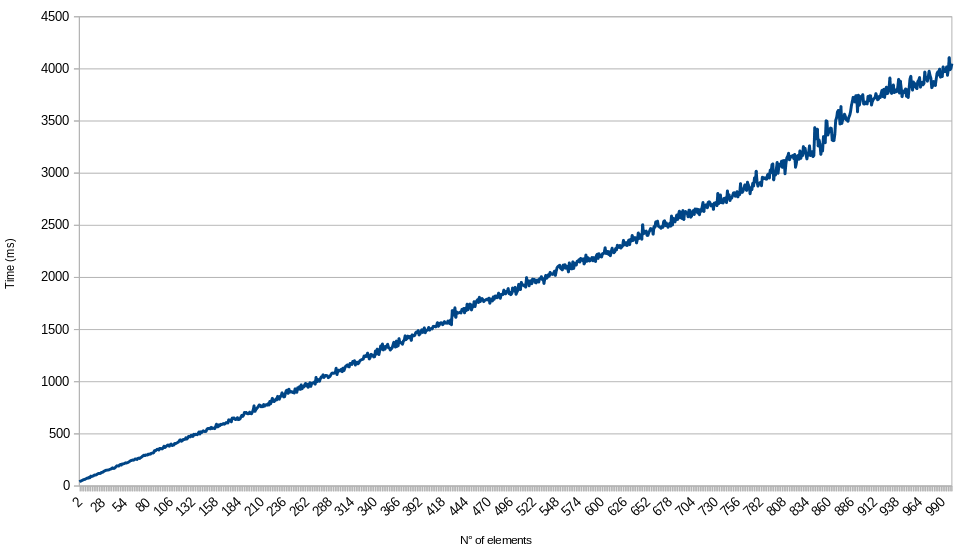

# CENUM - zero-cost enum replacement header

**Cenum** is a _C++20_ header that provides a complete replacement for enums. Cenum is licensed under the [GNU GPLv3](https://www.gnu.org/licenses/gpl-3.0.en.html).

# Table of contents
- [Usage](#usage)
  - [Getting started](#getting-started)
  - [Iterating](#iterating)
  - [Quick reference](#quick-reference)
- [Implementation](#implementation)
  - [Fundamental differencies with enums](#fundamental-differencies-with-enums)
  - [About macros](#about-macros)
- [Performances](#performances)
  - [Memory](#memory)
  - [Speed](#speed)

## Usage
### Getting started
First, you need to include the header in your program, then you can start to write an enum declaration
```c++
#include "Cenum.hpp"

MAKE_CENUMV_Q(PIN, unsigned,
  LedRed, 13,
  LedBLUE, 9,
  Switch, 10,
);

int main()
{
  PIN pin; // Will be initialized with PIN::LedRed
  pin = Switch; // Same as 'pin = Pin::Switch;'

  // Do something with pin
  if (pin.value == LedRed) // Same as 'if (pin == LedRed)'
  [ ... ]
}
```

### Iterating
#### Without the standard library
**Cenum** provides a way to iterate over a range of elements without the use of the standard library.
```c++
MAKE_CENUM_Q(Numbers, int,
  a, 127,
  zero, 0,
  twelve², 144, // C++17 introduces unicode support for identifiers
  four, 4,
  y, 3,
  x, 9);

int odds_sum = 0;
template <unsigned long long i>
struct Sum // Functor object
{
  void operator()()
  {
    constexpr Numbers d = Numbers::get<i>();

    if (d % 2)
      odds_sum += d;
  }
}

int main()
{
  Numbers::iterate<0, Numbers::size, 1, Sum>(); // odds_sum = 127+3+9
  return 0;
}
```

Using `index_sequence`s from the standard library will, in most cases, be replaced with much simpler and direct code by the compiler, to prodoce the exact same code as the method using a functor (from above). That's why you might consider using the standard library, because you cannot declare structs everywhere (as opposed to lambdas). Nevertheless, you may not have the possibility to link the standard library in your project.

#### Using the Standard library
There exists a simpler way to iterate using the standard library.
```c++
#include <functional>
// [...] Using the same enum
int odds_sum = 0;

int main()
{
  []<std::size_t... i>(std::index_sequence<i...>)
  {
    (([]()
    {
      constexpr Numbers d = Numbers::get<i>();

      if (d % 2)
        odds_sum += d;
    }(), i), ...);
  }(std::make_index_sequence<Numbers::size-1>{}); // odds_sum = 127+3+9
  return 0;
}
```
We have to add a useless **`, i`**, otherwise, the compiler cannot detect that we are using `i` as a the parameter for the fold expression (which will not appear in the binary anyway...).

In this case, using two lambdas is sub-optimal, because we could use a ternary operator and make the code cleaner. Nevertheless, the goal here is to compare with the method which does not use the standard library. Below is a much cleaner more natural implementation of the previous algorithm:
```c++
int odds_sum = []<std::size_t... i>(std::index_sequence<i...>)
{
  return (( (Numbers::get<i>() % 2) ? Numbers::get<i>() : 0 )+ ...);
}(std::make_index_sequence<Numbers::size-1>{}); // odds_sum = 127+3+9
```

### Quick reference
| Cenum | With enum | Explanation |
| --- | --- | --- |
| **`MAKE_CENUM_Q(EnumName, int, ...)`** | `enum class EnumName : int { ... }` | Create an enum named `EnumName` with elements of type `int`. Accessing an element from the enum will require the syntax: `EnumName::element_name` |
| **`MAKE_CENUMV_Q(EnumName, int, ...)`** | `enum EnumName : int { ... }` | Create an enum named `EnumName` with elements of type `int`. Accessing an element from the enum will require the syntax: `element_name` |
Using the macros `MAKE_CENUM` and `MAKE_CENUMV` will do the same as above, but they let you configure more about the types used in the enums. You can use these macros if you need to change the `__size_type` of the enums (`unsigned long long` by default)

From here, we assume that `MyEnum` is a Cenum.
| Code | Explanation |
| --- | --- |
| **x.value** | - **`x: MyEnum`**<br>Access the value stored in x.<br>You can achieve this by casting `x` to an element of type **`value_type`**<br>**e.g:** `value_type n = x;` (Can be implicitly casted) |
| **`MyEnum::size`** | This corresponds the number of elements in `MyEnum`. |
| **`MyEnum::get<i>()`** | - **`i: size_type`**<br>Get the _i-th_ element of the enum (from the order they were declared).<br>It will `static_assert` if there are no elements at index _i_.  |
| **`MyEnum::ord<value>()`** | - **`value: value_type`**<br>Get the index of `value`.<br>It will `static_assert` if `value` is not part of `MyEnum`.<br>In case multiple elements are sharing value `value`, it will return the index of the first of these elements. |
| **`MyEnum::iterate<Beg, End, Inc, Functor>()`** | - **`Beg: size_type`**<br> - **`End: value_type`**<br> - **`Inc: value_type`**<br> - **`Functor:`** a functor that has a template paremater of type **`size_type`**<br>Will call `Functor<i>::opeator()` on an instance of `Functor<i>`. With _i_'s varying from `Beg` to `End` with an incremen of `Inc` between each call. |

## Implementation
The current implementation will use structs to represent enums. The storage for each of the enum's values are **`constexpr static inline`**. This means that the variables are almost guaranted to not be stored in the memory.
**C++ Code:**
```c++
#include "Cenum.hpp"

MAKE_CENUM_Q(MyEnum, int,
  a, 12,
  b, 8,
  val, 127);

int prod = 1;
template <unsigned long long i>
struct Prod
{
  void operator()()
  {
    prod *= MyEnum::get<i>();
  }
};

int main()
{
  MyEnum::iterate<0, MyEnum::size, 1, Prod>();

  return 0;
}
```
**Generated x86_64 `g++ -std=c++20 -O1 a.cpp` (gcc10.2):**
```x86_64
main:
        imul    eax, DWORD PTR prod[rip], 12192
        mov     DWORD PTR prod[rip], eax
        mov     eax, 0
        ret
prod:
        .long   1
```
**Note:** Currently, clang11.0.1 requires at least `-O2` to produce the same code.

The compiler correctly figured out that it could directly compute the value of the product, nevertheless, it will compute one useless multiplication at the begining.

### Fundamental differencies with enums
Below is a list of major differences between cenum and enums. Take note that the _added_ features are not listed here.
 * An instance of a Cenum can be implicitly cast to `value_type`.
 * In the language, an instance of an enum has the same type as the enum's type. To solve this issue, you can access an instance's value through the `value` member. To make this simpler, you can use a cast to `value_type`. A similar way to solve this problem would be to have a Cenum act as a derived class of `value_type` , however primitives cannot be derived in C++.
 * An instance of enum will be default-initialized with **`::get<0>()`**, while language enum's instances are default-initialized with **`value_type()`**.

### About macros
**Cenum** extensively uses preprocessor macros. Since macros are not _Turing-complete_ per se, there is a limit to how many elements can be inside an enum at once (current limitation is **1024** elements).
**Cenum** makes use of the non-standard `__COUNTER__` directive. Currently, `gcc`, `clang` and `msvc` implement this directive.

As a design principle, all macros used inside `Cenum.h` are prefixed with `__CENUM_`. These macros are not meant to be used outside of `Cenum.h`.

## Performances
### Memory
As stated previously, a **Cenum** has zero memory footprint because values of a Cenum are not stored in the memory. However, the code generated by iterating over a Cenum can get quite large (up to proportional to the number of iterated elements). For instance, take a look at the following example:

This is our C++ code, we iterate over all 1000 elements of a Cenum:
```c++
#include <cstdio>
MAKE_CENUMV_Q(MyEnum, int,
  val0, 0,
  val1, 1,
  [...]
  val999, 999);

template <unsigned long long i>
struct Print
{
	void operator()()
	{
		printf("%d\n", MyEnum::get<i>());
	}
};

int main()
{
	MyEnum::iterate<0, MyEnum::size, 1, Print>();

	return 0;
}
```

This is the generated `x86_64` code:
```x86_64
.LC0:
        .string "%d\n"
main:
        sub     rsp, 8
        xor     esi, esi
        mov     edi, OFFSET FLAT:.LC0
        xor     eax, eax
        call    printf
        mov     esi, 1
        mov     edi, OFFSET FLAT:.LC0
        xor     eax, eax
        call    printf
        mov     esi, 2
        mov     edi, OFFSET FLAT:.LC0
        xor     eax, eax
        call    printf
        [...]
        mov     esi, 999
        mov     edi, OFFSET FLAT:.LC0
        xor     eax, eax
        call    printf
        xor     eax, eax
        add     rsp, 8
        ret
```
This has been verified with gcc10.2 and clang11.0.1 (both with `-Os`). And also verified using the `index_sequence` way of iterating.

Below is what the compiler could have generated. The code is 'cleaner', however it now contains branching:
```x86_64
.LC0:
        .string "%d\n"
main:
        push    rbx
        xor     ebx, ebx
.L2:
        mov     rsi, rbx
        mov     edi, OFFSET FLAT:.LC0
        xor     eax, eax
        inc     rbx
        call    printf
        cmp     rbx, 1000
        jne     .L2
        xor     eax, eax
        pop     rbx
        ret
```
The trick here is that the 1000 elements in the enum are just integers from 0 to 999.

### Speed
In general, the speed of a Cenum is exactly the same as that of a regular enum.

I have measured compilation time of Cenum's enums. Below is the compilation time of an enum in function of its number of elements:


As you can see, the compilation time is proportional to the number of elements, which is to be expected because of the preprocessor iteration algorithm.
